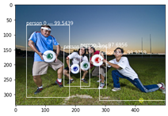
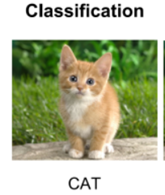
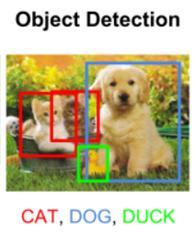
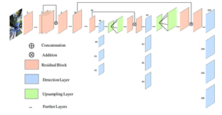
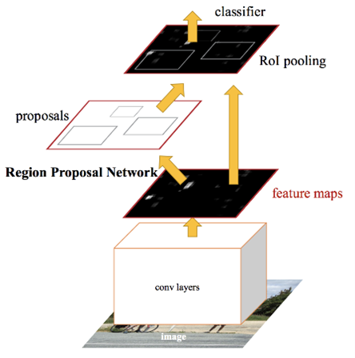
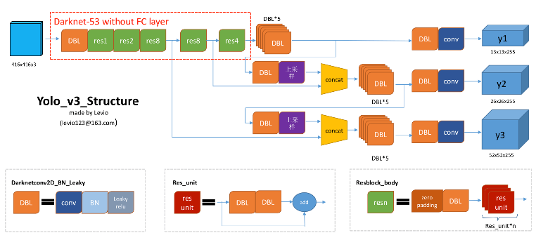
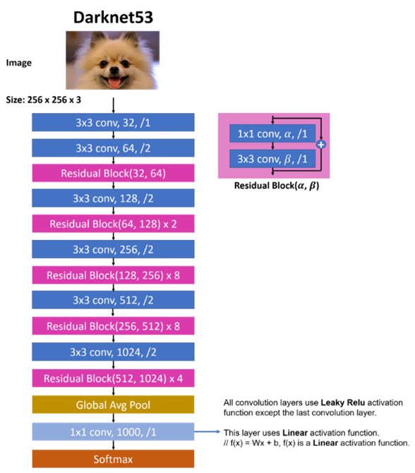
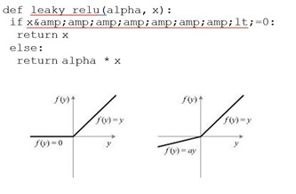

# Getting started
- Download all the .ipynb files.
- Create environment using anaconda.
- Install all the required packages using conda.
- First run model.ipynb to get the model.h5 file.
- Now run helper_funcs.ipynb to load all necessary funmctions.
- Then run detect_on_image.ipynb or detect_on_webcam.ipynb to start detecting.

# CSE 6363-003 Machine Learning Term Project

**Human Counting on a Frame using OpenCV**

## Abstract

Object detection is a computer technology related to computer vision and image processing. It allows us to identify and locate objects in an image or video (we can also use it on live stream). Object detection can be used to count objects in a scene and determine and track their precise locations, all while accurately labeling them which is very useful for many security systems also, it has various real-time applications such as surveillance, robotics, and biometrics.

Boundary boxes in object detection

## Introduction

### In computer vision, there are three types of tasks:

### ImageClassification:

Image Classification concerns with type or class of the object in the given image. Output for this algorithm is a class label for inputphotographs

**Object localization:**

Object localization is the primary concept behind all image detection algorithms. _Object localization__ _refers to identifying the location of one or more objects in an image and drawing abounding box around their extent.

Instance segmentation is one of those ways of localization. In instance segmentation, a bounding box is created around the object, and a label to which that object belongs is created at the top of the object. Whereas in image segmentation, the boundary is created around the object and it&#39;s also pixel-wise. In- stance segmentation creates square or rectangle boundaries.

### Object Detection:

Object detection is a computer vision technique to identify various objects from an image or a video.

Object detection outputs class labels with proper boundary boxes for objects in the image.

### Various algorithms can be used for Object Detection using Deep Learning some of them are:

**YOLO:**

YOLO uses convolutional neural networks for predict ion of class labels and object&#39;s location also.

YOLOv3 is more accurate and faster than previous versions and SSD (Single Shot MultiBox Detector).

Here is the brief introduction on the previous versions of YOLO algorithm:

### YOLOv1:

YOLOv1 uses the darknet framework and works the same as YOLOv3 works. But the main problem with yolov1 was cluster classification. It cannot recognize small objects which are closer to each other. The algorithm reads them as a cluster and identifies only some ofthem.

### YOLOv2:

Yolov2 introduced many new features over version 1. Such as batch normalization, anchor boxes, multiscale training, and also new darknet architecture. It works better than YOLOv1 with good accuracy and can also detect small objects from an image.

**YOLOv3:**

YOLOv3 is a real-time, single-stage object detection model that builds on YOLOv2 with several improvements. Improvements include the use of a new backbone network, Darknet-53 that utilizes residual connections, or in the words of the author, &quot;those newfangled residual network stuff&quot;, as well as some improvements to the bounding box prediction step, and use of three different scales from which to extract features (similar to an FPN).

YOLOv3 Structure

### How does YOLO work?

YOLO looks at an image only once. And then applies only one neural network on the image. The image is divided into the SxS grid. Each cell can predict N bounding boxes. A rectangle is formed from these bounding boxes to enclose an object within it. So total, SxSxN boxes can be predicted from the given image. Each bounding boxes has its own predictedprobabilities.

YOLO outputs a confidence score that tells us how certain it is that the predicted bounding box encloses the object. The task here is to categorize each object based on the class shown in the image or the video. The output for a given input image will be a confidence score that tells ushow certain it is that the predicted bounding box encloses the object.

### SSD:

SSD algorithms (Single Shot MultiBox Detector) have a good balance between their accuracy and speed. The SSD uses a small two-sided kernel on the feature map created by CNN and image. By doing so, it automatically predicts binding boxes and segmentation opportunities.

An SSD works better on larger objects than on smaller ones. We can say that its performance is similar to the Faster-RCNN of the big objects.

### FasterR-CNN:

Faster R-CNN consists of Region Proposal Network (RPN) and Fast-RCNN. Anchor boxes are introduced in faster-RCNN. There are three types of anchor box- es, 128x128, 256x256, and 512x512. Additionally, it has three aspect ratios. (1:1, 2:1, 1:2). This gives a to- tal of 9 boxes to predict the probability. This is the output of RPN, which is given to Fast-RCNN. Here, the spatial pooling technique is applied along with re- gression.

Faster R-CNN is 10 times faster than Fast R-CNN for the same accuracy output.

Object detection with R-CNN

## Dataset Description

For this project, we used the dataset provided by our professor, **MS COCO (Microsoft common objects in con- text) dataset.**

- The dataset is created by gathering images of ordinary scenes, these scenes vary from normal to complex. These ordinary scenes in every single image contain basic items such as a person, car, animals, etc. in their common settings.
- It is large-scale object detection, segmentation, and captioning dataset. It has serval features like object segmentation, superpixel stuff segmentation. It also has over 330 thousand images and out of which more than 200 thousand images are labeled.
- It also contains around 1.5 million instances, 80 object categories, 91 stuff categories, and at least 5 captions per single image which makes this dataset versatile.
- The training set(2017 Train Images 18GB in size) consists of around 118 thousand images along with annotations(2017 Train/Val annotations 241MB in size).
- Download data at [http://cocodataset.org/#download](http://cocodataset.org/#download)

## Project description

### Description:

In this project, we will implement a Deep Learning based Object Detection System using the OpenCV library, MXNet framework, and YoloV3 algorithm, to detect the instances of semantic objects of a class human from an image or a video. To identify instances of semantic objects from a video we need to consider each frame of a video as an individual image. We can also use the same technique to detect the instances of semantic objects of other classes such as cars, animals, food, etc. We will be using the MS COCO dataset to train a model architecture that will take the images and videos as the input and then detect the total number of people present on a webcam or an image. The output will be a window showing live footage of webcam on which at the bottom, there will be a counter showing the total number of people present on the footage, also there will be a boundary box around all human class objects or any other class objects with a confidence level.

### YOLOv3:

**Following are the primary concepts of the YOLOv3 algorithm:**

Yolov3 Network Architecture

### Darknet architecture:

YOLOv3 uses darknet - 53 build to add a feature to the image. As the name suggests it has 53 layers of communication. We know that the number of layers indicates how deep the art of construction is. YOLOv3 is a deeper builder than yolov2, as it only goes to 19 people. There are 3x3 and 1x1 filters YOLOv3 formats that help extract features from the image, in all differentlayers.

Darknet-53 architecture

### Leaky ReLU:

We all know that ReLU (Rectified Linear Unit) is a great tool for activating neural networks. But one step ahead, Leaky ReLU is much better than ReLU itself. One of the benefits of a rewarding ReLU is that it almost eliminates the problem of &quot;dying ReLU&quot;. ReLU problem death refers to the output provided by the ReLU function for negative input (Always 0). In the ReLU leak, there is a small slope with no incorrect input values. That the output of those input values ​​will tend to be zero but not actually zero, which helps to find the best neurons in each layer of the convolutional network and therefore in the output results.

Here is a basic code to implement leaky ReLU in the program and a chart to represent its functionality. On the left-hand side is ReLU function, and the other chart postulates leaky ReLU. The function, f(y) = ay is the slope line for negative values, and in practice, the value of &#39;a&#39; is nearly around 0.01 – 0.001.

ReLU and leaky ReLU Function Graph

### Bounding boxes:

Bounding boxes are used to separate identified objects from one another. Logistic regression is used to predict the confidence score of the box.

### Anchor boxes:

In a single network layer, anchor boxes are responsible for classification and prediction. It uses k means clustering method for prediction.

### Batch normalization:

In general, we base our input data generally on activation tasks or other strategies to improve the performance of our model. If so, then can we disable our hidden layers to improve the efficiency of the model? The familiarity of the cluster is used to familiarize the input and concealment of the construction layers in order to improve. Collectively, it improves accuracy by 2%, and overuse can be reduced to a minimum.

### Accuracy threshold:

The main advantage of the model is that it produces bounding boxes of partially visible objects (which do not need to be identified) with less accuracy than other objects. After giving the value of the accuracy limit to the model, it will not look for items that offer less accuracy than the limit, resulting in better availability.

### Configuration parameter:

Additionally, the model can predict more than one bounding box for one object which sometimes overlaps on each other. The configuration parameter is set as the number of spacing boxes. We used different values ​​in the parameter to see how those boxes were made for different values. If we consider its value as 1.0, then it will show all possible binding boxes around the object. And at 0.1, it will delete some of the required boxes from the account. So typically, 0.5 or 0.6 is used for better finding and orderly extraction.

## Main references used for your project:

1. &quot;How to implement a YOLOv3 object detector from scratch in PyTorch&quot; on medium.com, from this blog we get a knowledge about overall features and understanding of YOLOv3. Like, bounding boxes, improvements in YOLOv3 over YOLOv2, anchor boxes, loss function.
2. We understand about how YOLOv3 works with darknet architecture, from this blog.
3. Implementation of Keras model and object detection.

## Configurationparameter

In our project, there is one function that sets the configuration parameter. What this parameter does is, it generalizes the bounding boxes which generate around one object only. For a single object, we get multiple boxes. This parameter chooses the best box from them which can get a label accordingly. In one of those references, one person did not set the value for the configuration parameter and gets the accuracy of around 70%. But after implementing this parameter our accuracy has risen by 8 to 10%.

### Accuracy Thresholdvalue

While using different threshold values for accuracy, we got different numbers of objects in each output. This is be- cause, every time we change threshold value, objects with accuracy below threshold value will be dropped from final accuracy measurement and output. Due to this, the model will not get the same number of objects each time.

These are some results we got for the same image with different threshold parameters, but with the same configuration parameter value (0.5).

| Accuracy Thresholdvalue | Accuracy | Number of objects: |
| --- | --- | --- |
| 60% (0.6)               | 98.96%   |
| 40% (0.4) | 97.01% | 8 |
| 90% (0.9) | 99.27% | 4 |

## List of our contributions in the project:

  1. Data augmentation. (Augmented annotation files withdataset).
  2. Using the threshold and configuration parameters we get our bestaccuracy.
  3. We trained the Keras model using YOLOv3 to generate new weights to detect the objects in the image.
  4. We tried different activation functions to see the change of the accuracy of the imagedetection.
  5. We calculated an individual accuracy of each object in the image then took the average of accuracies of all the objects in that image to get a cumulative accuracy of all the objects in thatimage.
  6. Increase in accuracy with respect to the original reference we used for ourproject.

## Analysis

### What did we do well?

In the first phase of the project, we had no idea for TensorFlow, Keras, YOLO models, Matplotlib, Neural Networks, Activation Functions. But now we get know of these terms very well and as a result we have been able to create a basic model for classify other objects from a given image.

The references we used did not calculate the accuracy of each object, separately. We considered calculating that and compiling all the calculated data and achieving the most common accuracy of a single image which helped us to get more general ideas about algorithm design.

### What could we have done better?

At the starting phase of the project, we were thinking about implementing the project not only for image or single pho- to but also for real-time videos. Such as, detecting cars and people in the given video of city traffic. But because of less time, increasing difficulties to implement the project, and also due to limited amount of resources we were not able to implement thisidea.

If we were able to implement this thing than it could be helpful in big areas of computer vision like a surveillance system, unmanned vehicle systems, robotics, etc.

### What is left for future work?

For future work, we can work on getting better and better accuracy for just a single image. After that, we can think of

our basic and main idea to implement it for real-time vid- eo, for tracking application. This application requires a lot of high computation computers to generate an effective algorithm and proper environment to deploy that system.

One more idea is that, making a shopping application that detects the object and gives the best price, link to buy it from, and reviews of thatitem.

**Conclusion**

Object detection is a key concept in robotics and computer vision areas researches. It needs a huge amount of attention to give superior results in better advancements of human- kind. Although, there have been many researches conduct- ed and many more are still going on in computer vision, they are not enough as compared to technological ad- vancements of the 21st century. Object detection can be highly used in real-time applications like tracking applica- tions, surveillance systems, pedestrian detection, and un- manned vehicle systems.

But what we have learned so far in this project, is that for object identification, YOLOv3 is a well-defined ap- proach. It gives good accuracy even for small datasets, because of it having deep architecture and complex model network.

**References**

1. Lin, Maire, Michael, Belongie, Serge, Bourdev, … Pi- otr. (2015, February 21). Microsoft COCO: Common Objects in Context. Retrieved from[https://arxiv.org/abs/1405.0312](https://arxiv.org/abs/1405.0312)
2. Bansal, N. (2020, March 9). Object Detection using YoloV3 and OpenCV. Retrieved from[https://towardsdatascience.com/object-detection-using-](https://towardsdatascience.com/object-detection-using-yolov3-and-opencv-19ee0792a420)[yolov3-and-opencv-19ee0792a420](https://towardsdatascience.com/object-detection-using-yolov3-and-opencv-19ee0792a420)
3. Redmon, J. (n.d.). Retrieved from[https://pjreddie.com/darknet/yolo/](https://pjreddie.com/darknet/yolo/)
4. Tianxiang, &amp; Liu, I. (2019, September 30). Real-time Mobile Video Object Detection using Tensorflow. Re- trieved from[https://towardsdatascience.com/real-time-](https://towardsdatascience.com/real-time-mobile-video-object-detection-using-tensorflow-a75fa0c5859d)[mobile-video-object-detection-using-tensorflow-](https://towardsdatascience.com/real-time-mobile-video-object-detection-using-tensorflow-a75fa0c5859d)[a75fa0c5859d](https://towardsdatascience.com/real-time-mobile-video-object-detection-using-tensorflow-a75fa0c5859d)
5. Top stories about Yolo written in 2019. (n.d.). Re- trieved from[https://medium.com/tag/yolo/archive/2019](https://medium.com/tag/yolo/archive/2019)
6. Kathuria, A. (2018, April 29). What&#39;s new in YOLO v3? Retrieved from[https://towardsdatascience.com/yolo-v3-object-](https://towardsdatascience.com/yolo-v3-object-detection-53fb7d3bfe6b)[detection-53fb7d3bfe6b](https://towardsdatascience.com/yolo-v3-object-detection-53fb7d3bfe6b)
7. Redmon, J. (n.d.). Retrieved from[https://pjreddie.com/darknet/yolo/](https://pjreddie.com/darknet/yolo/)
8. Rieke, J. (2018, October 29). Object detection with neu- ral networks. Retrieved from[https://towardsdatascience.com/object-detection-with-](https://towardsdatascience.com/object-detection-with-neural-networks-a4e2c46b4491)[neural-networks-a4e2c46b4491](https://towardsdatascience.com/object-detection-with-neural-networks-a4e2c46b4491)
